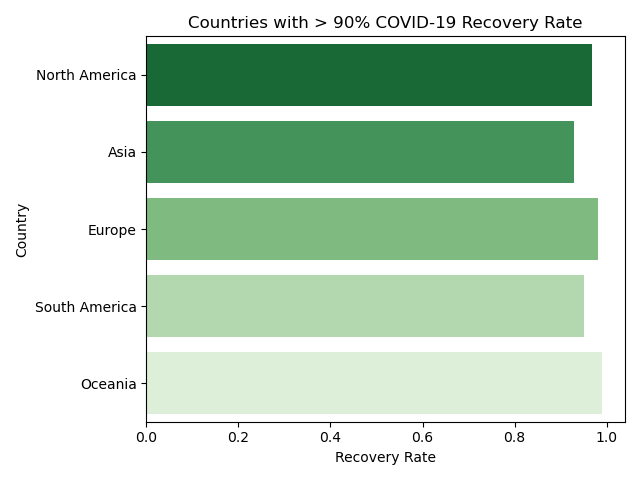
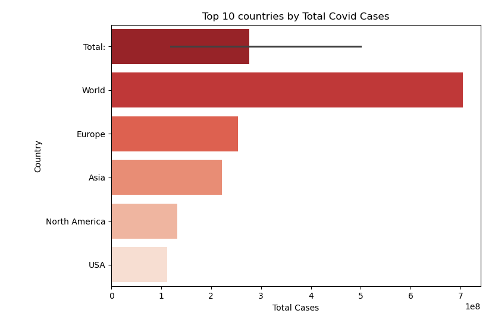

# Covid19_WebScraping_Data
# 🌍 COVID-19 Data Analysis Project

This project analyzes global COVID-19 data using **Pandas**, **SQL** and **Matplotlib**. It includes SQL queries and Python visualizations to explore key metrics such as total cases, deaths, recovery rate, and more.

---

## 📌 Features

- 🔝 Top 10 countries by total cases  
- ☠️ Countries with the highest mortality rate (`TotalDeaths / TotalCases`)  
- 🌍 Continent with the highest average active cases per country  
- 📈 Countries with over 1 million total cases  
- 💚 Countries with more than 90% recovery rate  
- 🧪 Top 5 countries by total tests conducted  
- 🔎 Continent/country with the highest number of active cases  

All results are visualized using bar plots where applicable.

---

## ⚙️ Installation

1. **Clone the repository**

git clone [https://github.com/yourusername/covid-analysis.git](https://github.com/kubraguran/Covid19_WebScraping_Data.git)
cd covid-analysis

2.  pip install pandas matplotlib sqlalchemy

And Check Results

 

 

